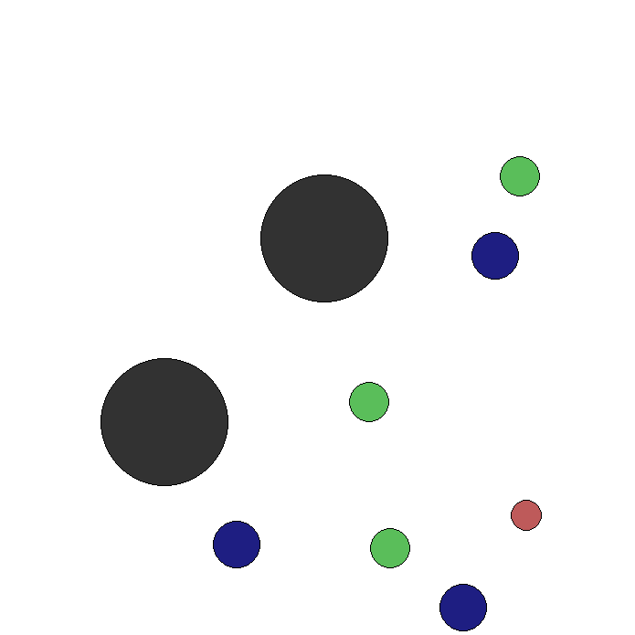

# Multi-Agent Particle Environments - Mixed Cooperative-Competitive Environments

## Overview
Reinforcement learning (RL) has demonstrated remarkable success in solving challenging problems, from game playing to robotics, and is emerging as a key component in large-scale industrial systems. However, most successes have focused on single-agent domains, where modeling the behavior of other actors is unnecessary.

This project is inspired by the paper **[Multi-Agent Actor-Critic for Mixed Cooperative-Competitive Environments](https://arxiv.org/abs/1706.02275)**, which adapts actor-critic methods to consider action policies of other agents. It presents:
- A learning approach that enables agents to develop complex multi-agent coordination strategies.
- An ensemble-based training regimen for agents, enhancing robustness and adaptability in multi-agent environments.

Using the **PettingZoo MPE environments** as a foundation, this project introduces a custom environment that builds on the principles of cooperative and competitive multi-agent RL. Additionally, it allows for the training of agents in Multi-Agent Particle Environments (MPE) using the MADDPG algorithm.

## References
1. **Paper**: [Multi-Agent Actor-Critic for Mixed Cooperative-Competitive Environments](https://arxiv.org/abs/1706.02275)  
2. **Official Code Repository**: [OpenAI Multiagent Particle Envs](https://github.com/openai/multiagent-particle-envs)
3. **PettingZoo MPE Documentation**: [MPE Environments](https://pettingzoo.farama.org/environments/mpe/)

## Installation

### Prerequisites
This project requires **Python 3.8+**.  

To install the necessary dependencies:
1. Clone this repository:
```bash
git clone <repository-url>
cd <repository-directory>
```
2. Install the required packages manually:
```bash
pip install pettingzoo
pip install pygame
pip install numpy
pip install gymnasium
pip install supersuit
pip install stable-baselines3
pip install torch
pip install torchrl
pip install vmas
pip install tqdm
```
Or, install the dependencies from the `requirements.txt` file:
```bash
pip install -r requirements.txt
```

## Usage

### Running Standard MPE Environments

The MPE environments are located in the `MPE-environments/envs` directory. Each environment can be run directly by executing its corresponding Python file:
```bash
python <environment-name>.py
```

### Running Custom MPE
To explore the custom environment:
1. Navigate to the `custom-environment` directory:
```bash
cd custom-environment
```
2. Run the custom environment:
```bash
python main.py
```

The custom environment's implementation is located in `custom-env/env/custom_environment.py`.

### Training Agents on MPE using MADDPG
To train agents on the multi-agent particle environments:
1. Navigate to the `MPE-training-maddpg` directory:
```bash
cd MPE-training-maddpg
```

2. The Script can receive 5 arguments (1 mandatory, 4 optional) the mandatory argument must be the 1st argument, the other 4 do not have a specific order.
   
```bash
python main.py <environment-name>
```
For example, to train agents on the `simple_tag` environment:
```bash
python main.py simple_tag
```

We chose this 3 environments (not counting our custom environment) because of their different characteristics:
- **Simple Tag**: Competitive environment where agents are rewarded for capturing the adversary, without communication.
- **Simple Reference**: Cooperative environment where agents are rewarded for reaching landmarks, with communication.
- **Simple Crypto**: Mixed cooperative-competitive environment where agents are rewarded for reaching landmarks, with communication.

## Custom Environment

### Environment Description
The custom environment is a mixed cooperative-competitive environment where the good agents (bluish) are slower and are tasked with intercepting the adversary (reddish). The adversary is faster and is rewarded for reaching landmarks (greenish) without being detected by the agents. The environment includes obstacles (grayish) that block movement.
By default, there are 3 agents, 1 adversary, 3 landmarks, and 2 obstacles.

<p align="center">
    
</p>

### Real-world Applications
This environment can be used to model various real-world scenarios, such as:
- **Cybersecurity Defense**: Agents protect a network from malicious intruders while avoiding detection.
- **Wildlife Conservation**: Drones monitor protected areas and prevent poachers from crossing boundaries.
- **Military Strategy and Defense**: Systems work together to secure areas, stopping adversaries from infiltrating. 
